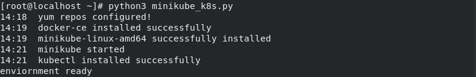

# minikube-bare-metal-installation


Script to install minikube along with kubectl on a linux machine. This installs the setup on bare-metal, not on a seprate VM.
This helps to install the kubectl controller and the minikube on the same machine.

# Using Python Script

In your linux terminal, to get the script
```
wget https://raw.githubusercontent.com/YashIndane/minikube-bare-metal-installation/main/minikube_k8s.py
```

To run

```
python3 minikube_k8s.py
```

On successfull run



alternative way to run -

```
bash setupmini.sh
```

To check status after setup run this -
```
minikube status
```

# Using Ansible role

The `setup.yml` file can be saved in any location, and mention the ip of target node in `ìnventory` file.

Set the roles path by -

```
ansible-playbook  <setup.yml-complete-path> --roles-path <complete-role-folder-path>
```

In the `ansible.cfg` file -

```
roles = <complete-role-folder-path>
```

Run the role by -

```
ansible-playbook <complete path of setup.yml>
```


